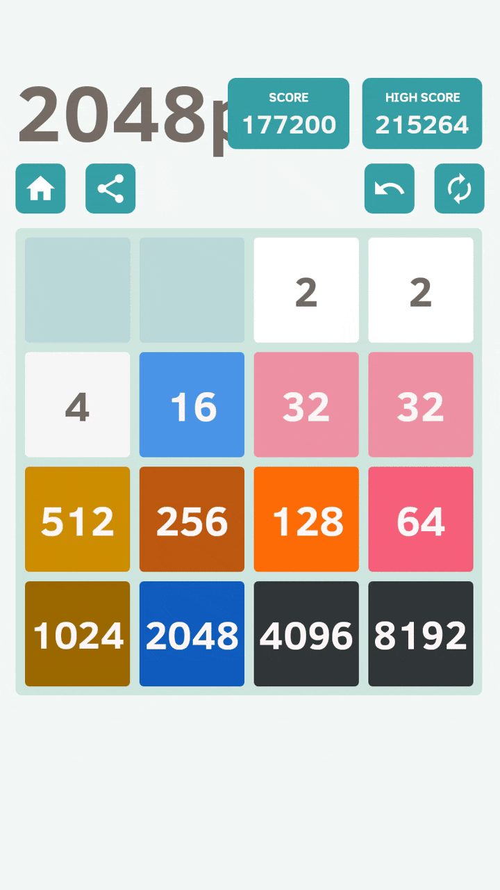

# 2048 Game Automation Tool

This repository contains a Python-based automation tool for the popular game 2048. The tool attempts to read the game board state and automatically send swipe commands (Up, Down, Left, Right, Undo) to progress through the game. Several approaches to tile detection are included, but the final solution uses **SSIM** comparison against a labeled dataset of tile images (e.g., `2.png`, `4.png`, `8.png`, etc.).



---

## Quick Start

1. **Clone the repo** and install dependencies:
   ```bash
   git clone https://github.com/Simba256/2048.git
   cd 2048
   pip install -r requirements.txt
   ```
2. **Open** the 2048 game in **Bluestacks** (or another Android emulator) in **fullscreen** mode (or ensure your coordinates match).
3. **Run** the main script:
   ```bash
   python main.py
   ```
4. The bot will attempt up to **1000 moves** by default to combine tiles and reach higher scores.

---

## Comparison of Detection Methods

| **Approach**                                      | **Implementation**      | **Accuracy**   | **Comments**                                                       |
|---------------------------------------------------|-------------------------|----------------|---------------------------------------------------------------------|
| **YOLOv11**                                        | Custom dataset          | 60–70%         | Tried multiple configurations; model struggled with numbers |
| **Tesseract OCR**                                  | Image preprocessing     | ~10%           | OCR was inconsistent for tiles, even after tuning             |
| **Image Hashing** <br>(average, pHash, wHash, dHash) | Hash-based comparisons  | ~95%           | Lightweight and reasonably fast, but some false positives           |
| **SSIM** (Final Approach)                         | Structural Similarity   | **100%**       | Perfect accuracy, slightly slower; robust to minor variations       |

Despite experimenting with multiple methods, **SSIM** emerged as the most reliable technique for consistently identifying all tile values.

---

## Features

- **Multiple tile-detection attempts**:
  - **YOLOv11** with a custom dataset
  - **Tesseract OCR**
  - **Hashing** with average, pHash, wHash, dHash
  - **SSIM** (final approach)
- **Configurable key mappings** for sending swipe and undo commands
- **Screenshots** for each cell (e.g., `cell_0_0_10.png`, `cell_3_3_10.png`) for debugging
- Adjustable board dimensions (default is **4×4**)
- Adjustable total moves to be made by the engine (default is **1000**)

*(More details below on installation, configuration, and usage.)*

---

## Installation

1. **Clone** this repository:
   ```bash
   git clone https://github.com/Simba256/2048.git
   cd 2048
   ```
2. **Install** required packages:
   ```bash
   pip install -r requirements.txt
   ```
3. **Set up** the Bluestacks (or your preferred emulator) window in fullscreen mode if you plan to use the included default coordinates. Otherwise, update the relevant constants in code (see **Configuration**).

---

## Usage

1. **Start** your Bluestacks emulator and open the 2048 game.
2. **Configure** key mappings inside Bluestacks to match the tool’s expected keys:
   - `Up` → **Arrow up**
   - `Down` → **Arrow down**
   - `Left` → **Arrow left**
   - `Right` → **Arrow right**
   - `Undo` → **u**

   These can be changed in [`game.py`](game.py) under the `key_map` dictionary:
   ```python
   key_map = {
       'up':    'up',
       'down':  'down',
       'left':  'left',
       'right': 'right',
       'undo':  'u'
   }
   ```
3. **Run** the script:
   ```bash
   python main.py
   ```
4. By default, the bot attempts 1000 moves. You can modify this in the `main.py` file if desired.


## Configuration

1. **Emulator Window Dimensions**  
   In [`game.py`](game.py) or wherever coordinates are set, ensure that your **EMULATOR** window dimensions match your display.

2. **Saving Screenshots**  
   Screenshots of each cell (e.g., `cell_0_0_10.png`, `cell_3_3_10.png`) are saved by default. Disable this by commenting out the line in [`cell_images.py`](cell_images.py) that writes the images.

3. **Grid Size (Default 4×4)**  
   If your 2048 variant uses a different grid (e.g., 5×5), adjust the `rows` and `cols` parameters in `main.py`.

4. **Number of Moves**  
   In `main.py`, you can change the loop that runs for `range(1000)` moves to a smaller or larger value as you prefer.

---

## How It Works

1. **Capture Board State**  
   The script takes a screenshot of each cell in the grid by parsing specific emulator coordinates.

2. **Tile Detection**  
   - **SSIM** (Structural Similarity) is the final approach used for tile recognition, referencing a labeled folder of tile images (e.g., `2.png`, `4.png`, etc.).

3. **Move Selection (Heuristic)**  
   - Encourages creation of larger tiles via exponential scoring.
   - Attempts to keep larger tiles in a decreasing order along the bottom row and rightmost column (chain heuristic).

4. **Repeat**  
   The process iterates until the move limit is reached or the game terminates.

---

## Contributing

Feel free to submit issues or pull requests to improve the code, enhance detection, or add more sophisticated game strategies.

---

## License

This project is provided under the [MIT License](LICENSE). You are free to fork, modify, and use it for your own 2048 automation endeavors.

**Happy automating, and may you reach that coveted `262144 👀` tile (or beyond)!**
